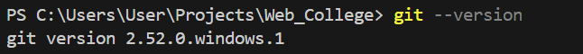
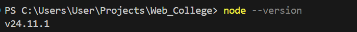
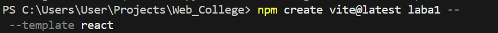
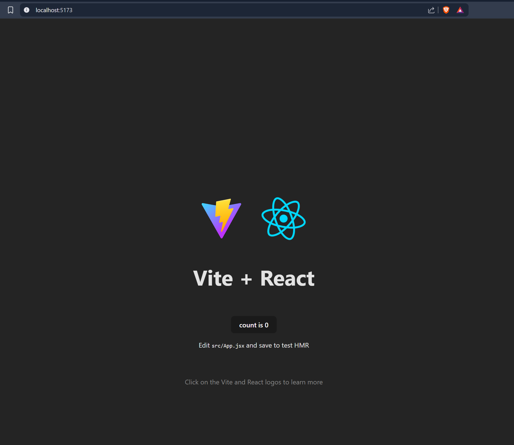

# Звіт з лабораторної роботи №1

**Студент:** [Влонга Андрій]  
**Група:** [42-КН]  
**Дата:** [15/01/2026]

---

## Мета роботи

Навчитись налаштовувати робоче середовище для розробки, використовувати git, створювати базові проєкти за допомогою React (Vite) та оформлювати звіти.

---

## Хід виконання роботи

### 1. Встановлення програмного забезпечення

**Node.js:**
- PS C:\Users\User\Projects\Web_College> node--version
v24.11.1
- Команда перевірки: `node --version`

**Git:**
- PS C:\Users\User\Projects\Web_College> git--version git version 2.52.0.windows.1- Команда перевірки: `git --version`

**Редактор коду:**
- Назва: [VS Code]

**Скріншоти:**  





---

### 2. Клонування репозиторію
```bash
git clone https://github.com/AndriyVlonha/Lab1_Web
cd laba1
npm run dev
```

---

### 3. Створення React-проєкту
```bash
pnpm create vite@latest laba1 -- --template react
cd laba1
pnpm install
```

---

## Результати роботи

1. Встановлено та налаштовано робоче середовище
2. Створено React-проєкт із використанням Vite
3. Виконано коміти після кожного етапу

---

## Висновки

У ході виконання лабораторної роботи було успішно налаштовано робоче середовище для розробки React-додатків. Освоєно базові команди git для version control. Створено початковий React-проєкт за допомогою сучасного інструменту Vite

---

## Посилання

- Репозиторій GitHub: [\[посилання\]](https://github.com/AndriyVlonha/Lab1_Web)
- Документація Vite: https://vitejs.dev/
- Документація React: https://react.dev/