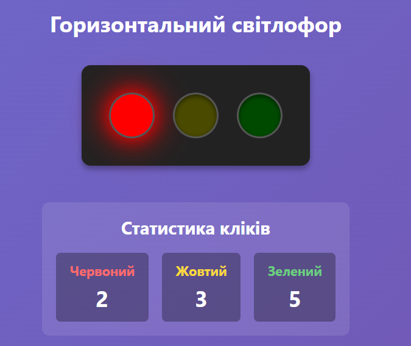
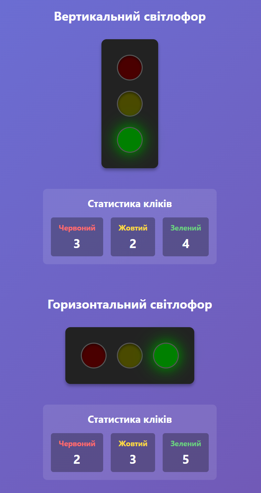
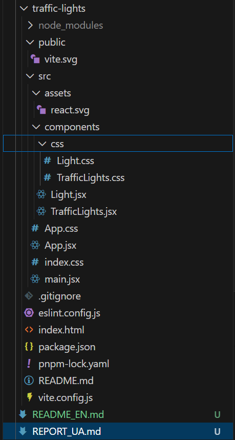
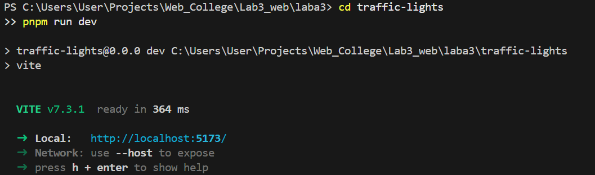

# Laboratory Report No. 3

**Student:** Andriy Vlonha  
**Group:** 42-CS  
**Date:** 10/02/2026

---

## Objective

To learn how to work with component state in React, handle events, and dynamically update the interface. Move all styles to separate CSS files.

---

## Procedure

---

### 1. Creating CSS Modules

Created separate CSS files for each component:
- `Light.css` - styles for Light component
- `TrafficLights.css` - styles for traffic lights and statistics
- `App.css` - global application styles

---

### 2. Light Component Update

**Changes:**
- Added `onClick` event handler
- Replaced all inline styles with CSS classes
- Used dynamic classes for active/inactive states
- Added hover effect for interactivity

**Code: `src/components/Light.jsx`**

**Description:**
- Component now fully uses CSS classes
- Added `onClick` prop for click handling
- Used CSS variables for glow colors

---

### 3. TrafficLights Component Update

**Changes:**
- Added `clicks` state to count clicks for each color
- Implemented `handleLightClick` function for event handling
- Added statistics block displaying click counts
- Replaced all inline styles with CSS classes
- Each traffic light has an independent counter

**Code: `src/components/TrafficLights.jsx`**

**Description:**
- Used state object to store clicks
- `handleLightClick` function updates corresponding counter
- Statistics are displayed in real-time below the traffic light

---

### 4. App Component Update

**Changes:**
- Replaced all inline styles with CSS classes
- Improved HTML semantics
- Added classes for better structure

**Code: `src/App.jsx`**

---

### 5. Application Demo

**Application Screenshots:**  

<div align="center">

  
  <p><b>Figure 3.</b> Vertical traffic light with click statistics</p>
  <br/>

  
  <p><b>Figure 4.</b> Horizontal traffic light after several clicks</p>
  <br/>

  
  <p><b>Figure 5.</b> Both traffic lights with independent counters</p>

</div>

---

### 6. Project Structure

**Screenshot:**  
<div align="center">
  <figure>
    
    <br/>
    <sub><b>Fig. 6:</b> Final project structure</sub>
  </figure>
</div>

---

### 7. Running the Project

```bash
cd traffic-lights
pnpm run dev
```

**Screenshot:**  
<div align="center">
  <figure>
    
    <br/>
    <sub><b>Fig. 7:</b> Result of executing <code>pnpm run dev</code> command</sub>
  </figure>
</div>

---

## Results

### Implemented Features:

1. **Click Counting:**
   - Each color click increments the corresponding counter
   - State is stored separately for each traffic light
   - Real-time statistics display
   - Independent counters for vertical and horizontal traffic lights

2. **Style Refactoring:**
   - All inline styles completely removed
   - Created separate CSS files for each component
   - Used CSS classes and CSS variables
   - Improved code structure and readability

3. **Event Handling:**
   - Added onClick handler for Light component
   - Implemented handleLightClick function
   - State updates via setState
   - Used callback functions for parameter passing

4. **UX Improvements:**
   - Added hover effect on lights
   - Cursor changes on hover
   - Smooth transition animations
   - Visual highlighting of active lights

### Technical Details:

- **React Hooks:** useState, useEffect
- **Event Handling:** onClick with parameters
- **CSS Organization:** Modular structure
- **State Management:** State object for counting
- **PropTypes:** Validation of all props, including functions
- **Best Practices:** No inline styles

---

## Conclusion

During this laboratory work, I successfully:
- Mastered working with events in React (event handling)
- Implemented dynamic UI updates based on state
- Completed full code refactoring by moving styles to CSS
- Improved project architecture and structure
- Added interactivity and user interaction tracking
- Created highly reusable components

Working with events and state enables creation of interactive and dynamic applications. Moving styles to separate CSS files significantly improves code readability, maintainability, and scalability. Using CSS classes instead of inline styles is a best practice in React development and allows efficient use of cascading style sheet capabilities.

Click counting demonstrates React's capabilities for tracking user interactions and updating the UI in real-time. Each traffic light has its own independent state, showing proper component isolation.

---

## References

- GitHub Repository: [link](https://github.com/AndriyVlonha/Lab3_WEB)
- React Events Documentation: https://react.dev/learn/responding-to-events
- useState Documentation: https://react.dev/reference/react/useState
- useEffect Documentation: https://react.dev/reference/react/useEffect
- CSS Modules in Vite: https://vitejs.dev/guide/features.html#css
- React Best Practices: https://react.dev/learn/thinking-in-react

---
